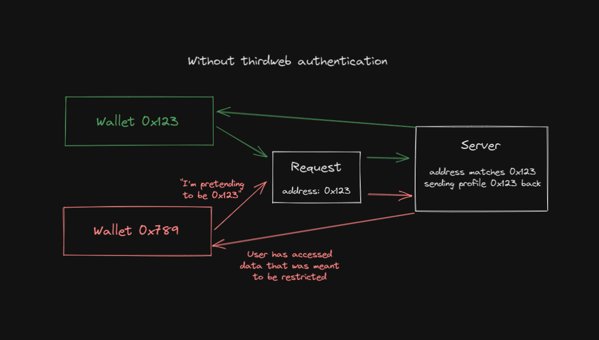
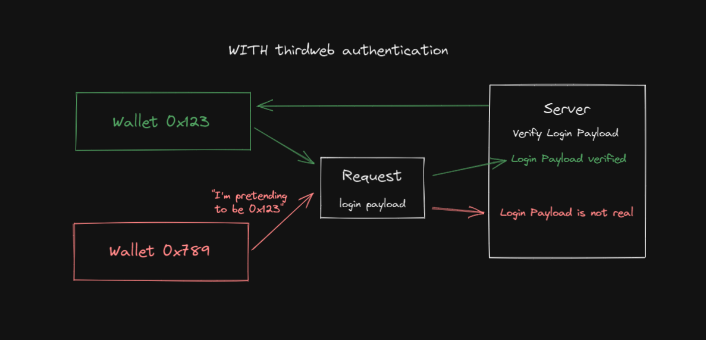

# NFT Gated Website

This project demonstrates how you can restrict content on your website to only those users who own an NFT from your collection.

We use an [Edition Drop](https://portal.thirdweb.com/pre-built-contracts/edition-drop) contract to enable users to claim one of the NFTs, and serve users
the restricted content if they have at least one of the NFTs claimed.

## Tools:

- [React SDK](https://docs.thirdweb.com/react): To access the connected wallet, switch the user's network, and claim an NFT from our Edition Drop collection.
- [Auth](https://portal.thirdweb.com/building-web3-apps/authenticating-users): To ask users to sign a message and verify they own the wallet they claim to be, while on the server-side

## Using This Template

Create a project using this example:

```bash
npx thirdweb create --authentication-restricted-content
```

- Create an [Edition Drop](https://thirdweb.com/contracts/new/pre-built/drop/edition-drop) contract using the dashboard.
- Replace instances of our contract address (`0x1fCbA150F05Bbe1C9D21d3ab08E35D682a4c41bF`) with the address of the contract you created in [index.js](/pages/index.js) and [the API route](/pages/api/get-restricted-content.js).

## How It Works

This template uses our [authentication SDK](https://portal.thirdweb.com/building-web3-apps/authenticating-users) to serve restricted content
to users who own at least one NFT from the collection.

### Sign In

When the user clicks the `Request Access` button, they are prompted to sign a message on the client-side, which uses the SDK to generate a login payload.

```jsx
// Add the domain of the application users will login to, this will be used throughout the login process
const domain = "thirdweb.com";
// Generate a signed login payload for the connected wallet to authenticate with
const loginPayload = await sdk.auth.login(domain);
```

### Request Restricted Content

This payload is sent in the `body` of a `fetch` request for restricted data on our API route on the server-side.

```jsx
// Make api request to server and send the login payload in the body
const response = await fetch(`/api/get-restricted-content`, {
  method: "POST",
  body: JSON.stringify({
    loginPayload,
  }),
});
```

### Verify User On the Server

On the server-side, we verify that the user is who they claim to be:

```jsx
// Get the login payload that we sent with the request
const { loginPayload } = JSON.parse(req.body);

const sdk = new ThirdwebSDK("mumbai");
const domain = "thirdweb.com";

// Use that login payload to verify the user
const verified = sdk.auth.verify(domain, loginPayload);
```

And then check if that wallet has at least one NFT from our collection:

```jsx
// Get addresses' balance of token ID 0
const balance = await editionDrop.balanceOf(loginPayload.payload.address, 0);

if (balance > 0) {
  // If the user is verified and has an NFT, return the content
  res.status(200).json({
    message: "This is the restricted content",
  });
} else {
  // If the user is verified but doesn't have an NFT, return a message
  res.status(200).json({
    message: "You don't have an NFT",
  });
}
```

### Why Is This Important?

Let's look at an example _without_ using the authentication SDK.

You could restrict access to content based on the wallet address that gets passed in as a `string` to the server-side. And when you make requests to the server, you could pass the connected wallet address in the request body.

For example, you might have an off-chain database that stores user profile information. You could say `if (user.address === walletAddress) { return userProfile }` to get the user profile and only allow the connected wallet to access it.

The security concern here is that users can make API requests with **any** value for that wallet address, meaning they can pretend to be another user/wallet. For example, if I try to access your profile, I could pass in your wallet address rather than mine in the request body, and see your profile!



With authentication, you can only access content that you have permission to access, since the login payload is verified on the server-side.



## Join our Discord!

For any questions, suggestions, join our discord at [https://discord.gg/thirdweb](https://discord.gg/thirdweb).
